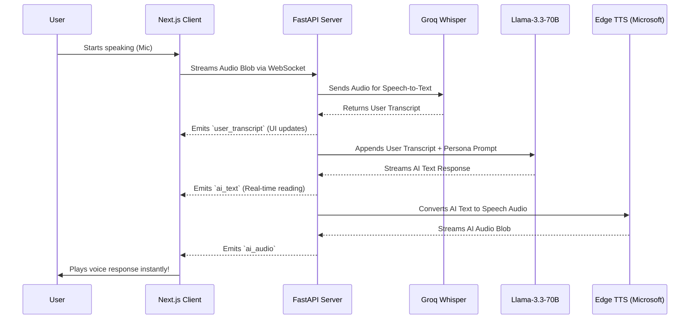

# 🎙️ FluentAI: Real-Time Speaking Coach

 


**FluentAI** is a real-time, low-latency conversational AI speaking coach designed to help users instantly improve their English fluency, grammar, and vocabulary. It leverages WebSockets to stream audio directly into an advanced AI pipeline, getting immediate verbal and textual feedback.

---

## ✨ Features

- **Real-Time Voice Conversations**: Talk seamlessly. The AI responds instantly through an ultra-fast WebSocket connection.
- **Dynamic Persona Modes**: Switch between Casual Conversation, IELTS Interview prep, Debates, and Roleplays in real-time.
- **Performance Analytics**: Track your XP, Fluency Scores, Speaking Time, and specific Grammar error breakdowns.
- **Comprehensive History**: Review past transcripts, track your daily speaking streaks, and review precise language corrections.
- **Achievements & Badges**: Unlock gamified profile badges dynamically based on your actual conversation metrics.

---

## 🏗️ Architecture Flow

FluentAI runs on an asynchronous pipeline heavily optimized for speed. Here is how the client and server communicate during a coaching session:



---

## 🛠️ Tech Stack

### Frontend (Next.js 15)
- **Framework:** React 19 / Next.js (App Router)
- **UI & Styling:** Tailwind CSS, Framer Motion, Shadcn UI
- **Charts:** Recharts for analytics dashboards
- **Auth:** Clerk + JWTs

### Backend (Python FastAPI)
- **API Server:** FastAPI + Uvicorn + WebSockets
- **Database:** SQLAlchemy + SQLite (PostgreSQL Ready)
- **AI Models:** Groq Cloud (`whisper-large-v3` & `llama-3.3-70b-versatile`)
- **Speech Synthesis:** `edge-tts` (Microsoft Neural Voices)

---

## 🚀 Getting Started Locally

### Prerequisites
- Node.js > 18.0
- Python 3.9+
- A [Groq API Key](https://console.groq.com/keys)
- A [Clerk Dashboard Account](https://dashboard.clerk.com/)

### 1. Backend Setup

```bash
cd backend
python -m venv venv
```

**Activate virtual environment:**
- Windows: `.\venv\Scripts\activate`
- Mac/Linux: `source venv/bin/activate`

```bash
pip install -r requirements.txt
```

Create a `.env` in the `backend` folder:
```env
DATABASE_URL=sqlite:///./fluentai.db
GROQ_API_KEY=your_groq_api_key_here
```

Start the Python server:
```bash
uvicorn app.main:app --port 8000 --reload
```

### 2. Frontend Setup

```bash
cd apps/web
npm install
```

Create a `.env.local` in the `apps/web` folder:
```env
NEXT_PUBLIC_CLERK_PUBLISHABLE_KEY=your_clerk_publishable_key
CLERK_SECRET_KEY=your_clerk_secret_key
NEXT_PUBLIC_API_URL=http://localhost:8000
NEXT_PUBLIC_WS_URL=ws://localhost:8000
```

Start the Next.js App:
```bash
npm run dev
```
*(Open http://localhost:3000 in your browser)*

---

## 📝 License

This project is licensed under the MIT License.
